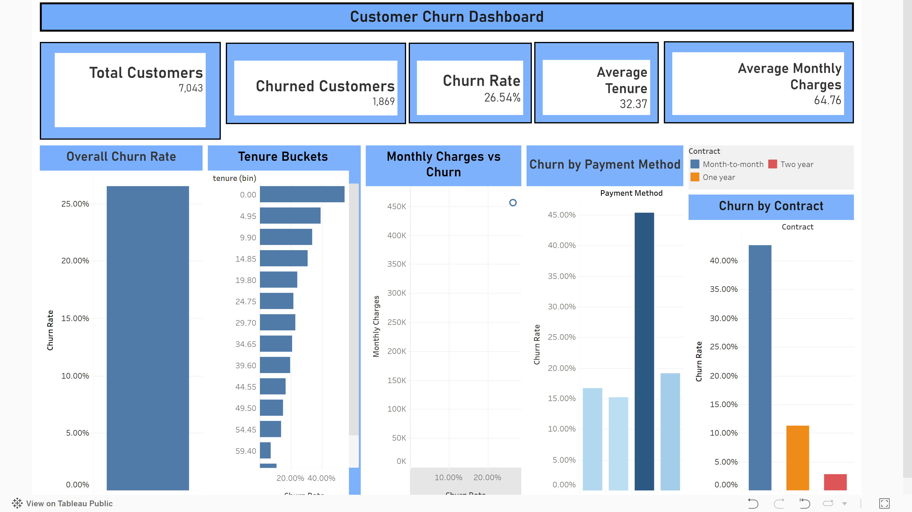

# Customer Churn Dashboard

An interactive Tableau dashboard analyzing customer churn patterns and behavior.

## 🔗 Live Dashboard
[View on Tableau Public](https://public.tableau.com/app/profile/meghraj.gautam/viz/CustomerChurnDashboard_17682020320060/Dashboard1?publish=yes)

## 📊 Dashboard Preview

## Key Insights
- Overall churn rate: 26.54%
- Average customer tenure: 32.37 months
- Analysis by payment method, contract type, and tenure buckets

## Tools Used
- Tableau Public
- Data Analysis & Visualization
